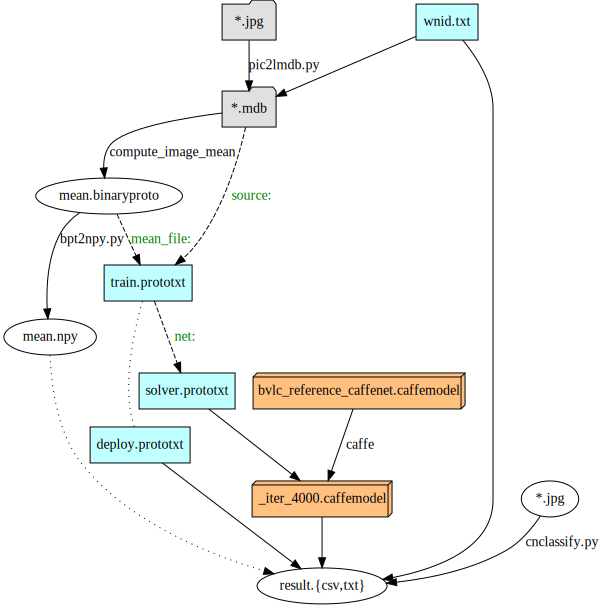

My attempt at transfer learning.

1. Start a [floydhub deep learning docker](https://github.com/floydhub/dl-docker)
2. ```pip install opencv-python lmdb```
3. Create lmdb's from pics: ```./pic2lmdb.py wnid-apes.txt /path/to/ape/pics```
4. Compute mean: ```$CAFFE_ROOT/build/tools/compute_image_mean -backend=lmdb /root/shared/imnet/training/```
5. Train: ```$CAFFE_ROOT/build/tools/caffe train --solver=/root/shared/imnet/ape/solver.prototxt --weights $CAFFE_ROOT/models/bvlc_reference_caffenet/bvlc_reference_caffenet.caffemodel ; date) 2>&1 | tee train.log```
6. Test on unknown images: ```./cnclassify.py -f csv -c /root/shared/imnet/ape/
   --labels wnid-apes.txt --mean mean.npy --model deploy.prototxt
   --weights _iter_4000.caffemodel```
   Note: By putting all the relevant files in /root/shared/imnet/ape/
   you can leave out the paths and just specify the file names
   for --labels, --mean, --model, and --weights .

You may need to change file and directory paths on the
command line as well as in the *.prototxt files.
Try ```./pic2lmdb.py -h``` and ```./cnclassify.py -h```
to see more options.
Code is forked from [deeplearning-cats-dogs-tutorial](https://github.com/adilmoujahid/deeplearning-cats-dogs-tutorial)
and extensively modified to make it more generic.
Also see the blog post: [A Practical Introduction to Deep Learning
with Caffe and Python](http://adilmoujahid.com/posts/2016/06/introduction-deep-learning-python-caffe/)
of the original author.
Use vimdiff or similar editors to study the difference
between my *.prototxt files and the corresponding
files from caffe or from the original author.

I hope the following illustration is helpful for other
deep learning newbies behind me.


